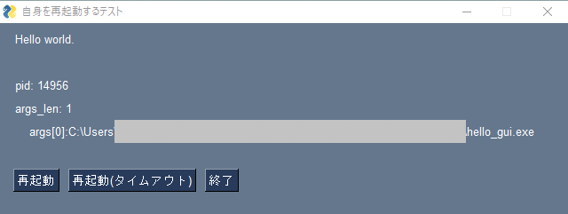

# dgfRestartExe
<small>by tomomori(daigo-friends)</small>
## Overview
### 実行形式をリスタートするためのプログラム
   

## Description
### あるプログラムが自分自身を再起動したいとき、このdgfRestartExeを起動してから自分自身を終了させる。dgfRestartExeは、受け取った引数を元に、起動元プログラムの終了を待ってから再起動を行う
* Windows用、ただし、PyInstallerが動作する環境であればMACなどでもビルド可能
   

## Demo
1. distフォルダをフォルダごとコピーする
1. hello_gui.exeをダブルクリックして起動する
1. 「再起動」ボタンをクリックする
1. 再起動されpidが変わっている事が確認できる
   

   

## Usage
* distフォルダにあるdgfRestartExe.exeとdgfRestartExe.jsonを、再起動したいプログラムと同じフォルダにコピーする
* 引数2つ(下記)を渡してdgfRestartExe.exeを起動する
    1. 自分自身の（起動中の）PID
    1. 再起動用のコマンドライン
* 自分自身を終了する
* 詳しくはhello_gui.pyを参照
   

## Install & Build

1. Clone or Fork or Download ZIP
1. cd dgfRestartExe
1. python -m venv venv
1. venv/Scripts/activate
1. python -m pip install --upgrade pip
1. pip install -r requirements.txt
1. pyinstaller src/dgfRestartExe.py --onefile --noconsole
1. pyinstaller src/hello_gui.py --onefile --noconsole
